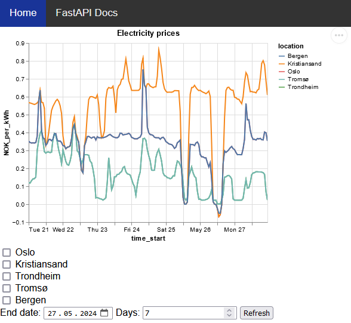

# Norway Electricity Prices

Python program that compares the electricity prices for the different price areas in Norway for a given period. Utilizes the [Strømpris API](https://www.hvakosterstrommen.no/strompris-api).

## Dependecies

Download dependecies with `pip install -r requirements.txt`.

## Usage

Run `python3 app.py` and open `localhost:5000`. The resulting web page enables users to choose areas and time periods to visualize and compare electricity prices.

