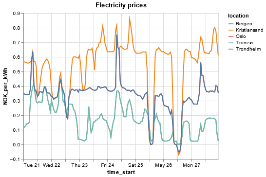

# Norway Electricity Prices

Python program that compares the electricity prices (NOK_per_kWh) for the five price areas in Norway over the last week. Fetches prices from [Strømpris API](https://www.hvakosterstrommen.no/strompris-api) with *requests*. Combines day prices for the different areas into a single *pandas* dataframe. Visualizes the dataframe with *altair* in a line plot.

## Dependecies

Download dependecies with `pip install -r requirements.txt`.

## Usage

### All areas

Run `python3 main.py` to compare all five areas in the same line chart.

### Single area

Sometimes the prices are the same for different areas, making the lines overlap. To only see the line of a specific area, insert the area code. For Oslo/East-Norway: `python3 main.py NO1`.

Area codes:
- NO1 = Oslo / Øst-Norge
- NO2 = Kristiansand / Sør-Norge
- NO3 = Trondheim / Midt-Norge
- NO4 = Tromsø / Nord-Norge
- NO5 = Bergen / Vest-Norge 